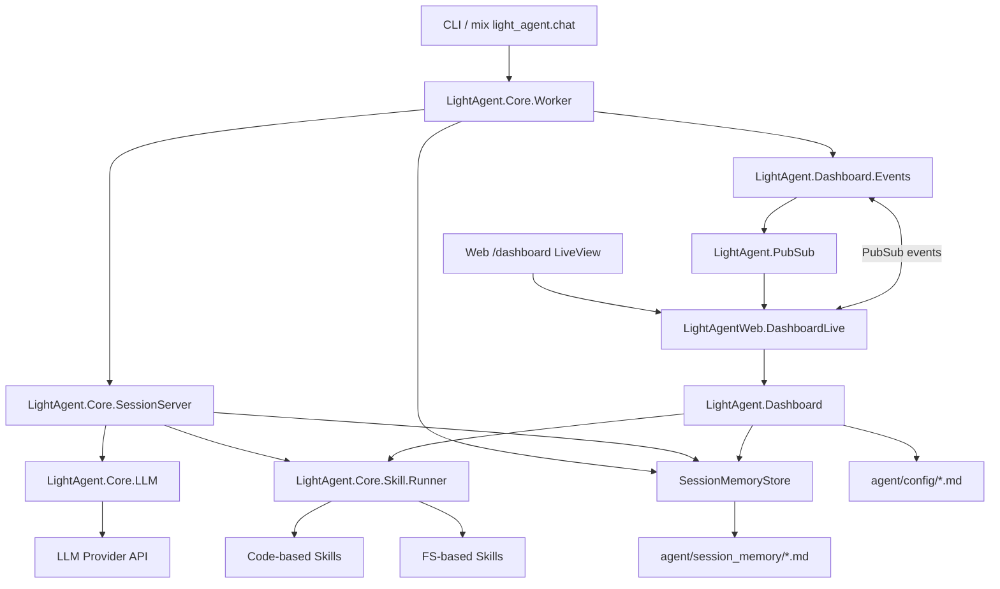

# LightAgent

LightAgent is a lightweight AI agent framework built with Elixir/OTP.
It provides a CLI-first workflow with multi-session state, tool calling, plan mode, and filesystem-based extensibility.

## Highlights

- Multi-session orchestration (`new/switch/pause/resume/delete`)
- Session persistence to markdown files with JSON payloads
- Dual LLM API format support:
  - Chat Completions
  - Responses
- Tool calling with schema validation (Ecto)
- Plan mode lifecycle (`drafting -> ready -> applying -> completed`)
- Runtime-loadable FS skills via `agent/skills/*/SKILL.md`
- Phoenix LiveView Dashboard for sessions/global context observability
- Realtime dashboard updates via PubSub + poll fallback
- Token usage tracking per step and per session
- Interactive confirmation for sensitive tools

## Requirements

- Elixir `~> 1.19`

## Installation

```bash
mix deps.get
```

## Configuration

Runtime LLM config is read from env vars in `config/runtime.exs`.

```bash
API_KEY=your-api-key
BASE_URL=https://api.openai.com/v1/chat/completions
MODEL=gpt-4.1
API_FORMAT=chat_completions
```

`API_FORMAT` supports:

- `chat_completions`
- `responses`

Notes:

- `BASE_URL` should match the selected provider endpoint format.
- LLM config is loaded under `config :light_agent, Core.LLM`.

Static app config (in `config/config.exs`):

```elixir
config :light_agent, :agent_external_root, "agent"
```

This root contains:

- `agent/config/` (context files)
- `agent/session_memory/` (session persistence)
- `agent/skills/` (filesystem skills)

## Quick Start

1. Install dependencies:

```bash
mix deps.get
```

2. Create a `.env` file in the project root and put the key config in it:

```bash
API_KEY=your-api-key
BASE_URL=https://api.openai.com/v1/chat/completions
MODEL=gpt-4.1
API_FORMAT=chat_completions
```

3. Start interactive CLI:

```bash
mix light_agent.chat
```

CLI commands:

- `/help`
- `/new`
- `/sessions`
- `/pause`
- `/switch <id>`
- `/resume <id>`
- `/delete <id>`
- `/history`
- `/usage`
- `/skills`
- `/tools`
- `/plan on|off|progress|apply`
- `/exit`

Special input:

- `//xxx` sends literal `/xxx` as plain user text.

## Dashboard (Phoenix LiveView)

Start web dashboard:

```bash
mix run --no-halt
```

Access URLs:

- `http://127.0.0.1:4000/`
- `http://127.0.0.1:4000/dashboard`

Current dashboard capabilities:

- Session list (left pane)
- Global card + Global detail (effective context files, skills, tools)
- Session detail and token usage
- Session history (reverse chronological order)
- Realtime refresh via PubSub + poll fallback

## Core Architecture

### Supervision tree

`LightAgent.Application` starts:

- `LightAgent.Core.SessionRegistry` (Registry)
- `LightAgent.Core.SessionSupervisor` (DynamicSupervisor)
- `Phoenix.PubSub` (`LightAgent.PubSub`)
- `LightAgent.Core.Worker` (session coordinator)
- `LightAgent.Core.Scheduler` (Quantum compaction jobs)
- `LightAgentWeb.Telemetry`
- `LightAgentWeb.Endpoint`

### Architecture diagram



### Runtime flow

1. CLI input is handled by `LightAgent.Core.Worker` and routed to the current `SessionServer`.
2. `SessionServer` calls `LightAgent.Core.LLM.call/3`, normalizes assistant output, executes tool calls, and persists history.
3. Worker broadcasts session/global updates through `LightAgent.Dashboard.Events` + PubSub.
4. LiveView (`/dashboard`) subscribes to events and refreshes UI state; polling provides fallback consistency.
5. `LightAgent.Dashboard` aggregates read models for session detail/history plus global context, skills, and tools.

## LLM API Compatibility

### Chat Completions mode

- Request body contains `messages` + `tools`
- Assistant message is read from `choices[0].message`

### Responses mode

- Request body contains `input` + `tools`
- Tool schema is mapped to top-level function shape (`type`, `name`, `description`, `parameters`)
- History mapping rules include:
  - assistant tool calls -> `function_call`
  - tool outputs -> `function_call_output`
  - no `role: "tool"` entries in `input`
- Assistant output is normalized from `output` items (`message`, `output_text`, `function_call`)

Public call entry remains stable:

- `LightAgent.Core.LLM.call/3`

## Sessions and Persistence

- Session state is hosted by per-session `SessionServer` processes
- Session IDs are restored from `agent/session_memory/session-*.md`
- Session payload is stored as markdown-wrapped JSON block
- Context files from `agent/config/{SOUL,USER,MEMORY,AGENT}.md` are loaded as system messages on new sessions

### Session compaction

`LightAgent.Core.SessionMemoryCompactor` summarizes/compacts persisted history and updates managed blocks in `agent/config/MEMORY.md`.
Compaction is scheduled via `LightAgent.Core.Scheduler` (Quantum).

## Plan Mode

Mode is controlled per session:

- `/plan on`: enter plan drafting mode
- `/plan apply`: move plan state to `applying` and execute
- `/plan progress`: show status/task progress
- `/plan off`: back to normal mode

Plan status transitions:

- `idle` -> `drafting` -> `ready` -> `applying` -> `completed`

Execution behavior:

- In drafting/ready phase, tool execution is blocked and the model should iterate plan JSON.
- In applying/completed phase, tool calls are allowed.

## Skill System

### Code-based skills

Built-in modules include:

- `LightAgent.Skills.Location`
- `LightAgent.Skills.Weather`
- `LightAgent.Skills.Filesystem`
- `LightAgent.Skills.RunCommand`
- `LightAgent.Skills.LoadFsSkill`

Tools are defined with `deftool/2` and validated via Ecto changesets.
`ToolArgsValidator` enforces schema before execution.

### FS-based skills

Filesystem skills live under:

```text
agent/skills/<skill_name>/SKILL.md
```

`load_skill_md` reads skill documentation at runtime.

## Security and Tool Confirmation

`LightAgent.Core.Skill.Runner` requires user confirmation for sensitive tool names:

- `run_command`
- `write_file`
- `delete_file`
- `remove_file`

Other tools run without confirmation after schema validation.

## Programmatic Usage

```elixir
{:ok, _pid} = Application.ensure_all_started(:light_agent)

result = LightAgent.Core.Worker.run_agent("What's the weather in Beijing?")

{:running, tool_results, usage} = LightAgent.Core.Worker.run_agent_step("Hello")
{:done, content, usage} = LightAgent.Core.Worker.run_agent_step()
```

## Testing

Run all tests:

```bash
mix test
```

Run key suites:

```bash
mix test test/light_agent/core/llm/request_mapper_test.exs
mix test test/light_agent/core/llm/assistant_message_normalizer_test.exs
mix test test/light_agent_test.exs
```

## License

MIT
